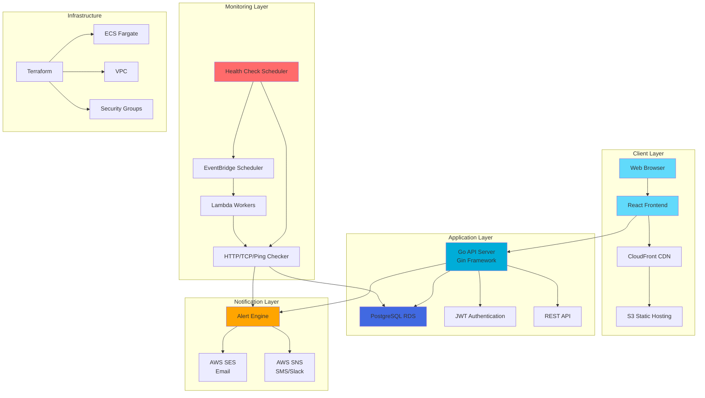

# PulseGrid - Cloud-Native Local Infrastructure Monitoring Platform


A full-stack, cloud-native monitoring platform that tracks the health, uptime, latency, and performance of web and cloud services.

[](https://your-demo-url.com)
[](https://your-api-docs-url.com)

## 📸 Screenshots

<div align="center">
  
### Dashboard Overview

*Real-time service monitoring dashboard with interactive charts and analytics*

### Service Management

*Add, edit, and monitor multiple services with custom health check intervals*

### Alert Configuration

*Configure email, SMS, and Slack notifications for service downtime*

### Health Check Details

*Detailed health check history with response times and status codes*

</div>

> **Note**: Replace placeholder images with actual screenshots of your application

## 🚀 Features

- **Service Monitoring**: Track uptime and performance of URLs, APIs, and IPs
- **Real-time Alerts**: Email, SMS, and Slack notifications during downtime
- **Interactive Dashboards**: Visualize real-time analytics and historical trends
- **Performance Reports**: Export weekly/monthly summaries as PDF or CSV
- **Multi-tenant**: Secure data isolation by organization
- **Cloud-Native**: Built on AWS with auto-scaling capabilities
- **Multi-Protocol Support**: HTTP/HTTPS, TCP, and ICMP (ping) monitoring
- **Intelligent Scheduling**: Per-service configurable check intervals
- **Alert Deduplication**: State transition-based alerting to prevent spam

## 🏗️ Architecture

### System Architecture Diagram



### Technology Stack

- **Frontend**: React.js + TypeScript + Tailwind CSS + shadcn/ui
- **Backend**: Go (Gin Framework) REST API
- **Database**: PostgreSQL (RDS)
- **Workers**: AWS Lambda (Go) for scheduled health checks
- **Infrastructure**: Terraform for AWS deployment
- **Notifications**: AWS SNS + SES
- **CI/CD**: GitHub Actions
- **Containerization**: Docker + Docker Compose
- **State Management**: Zustand
- **Charts**: Recharts
- **WebSockets**: Real-time updates

## 💻 Tech Stack & Key Skills

### Frontend Technologies
- **React 18.2** - Modern UI library with hooks and context
- **TypeScript 5.2** - Type-safe JavaScript for better developer experience
- **Vite** - Lightning-fast build tool and dev server
- **Tailwind CSS** - Utility-first CSS framework
- **Zustand** - Lightweight state management
- **React Router** - Client-side routing
- **Recharts** - Composable charting library
- **React Hook Form** - Performant forms with validation
- **Zod** - TypeScript-first schema validation
- **Three.js / OGL** - 3D graphics and animated backgrounds
- **GSAP** - Animation library for smooth transitions

### Backend Technologies
- **Go 1.21+** - High-performance, concurrent programming
- **Gin Framework** - Fast HTTP web framework
- **PostgreSQL** - Robust relational database
- **JWT** - Secure token-based authentication
- **Goroutines** - Concurrent health check execution
- **AWS SDK** - Cloud service integration

### DevOps & Infrastructure
- **Docker** - Containerization for consistent deployments
- **Docker Compose** - Multi-container orchestration
- **Terraform** - Infrastructure as Code (IaC)
- **AWS Services**:
  - ECS Fargate (Container orchestration)
  - RDS (Managed PostgreSQL)
  - S3 + CloudFront (Static hosting & CDN)
  - Lambda (Serverless functions)
  - EventBridge (Scheduled tasks)
  - SES (Email delivery)
  - SNS (Multi-channel notifications)
- **GitHub Actions** - CI/CD pipeline automation

### Key Skills Demonstrated
- ✅ Full-stack development (React + Go)
- ✅ RESTful API design and implementation
- ✅ Database design and optimization
- ✅ Authentication & authorization (JWT)
- ✅ Real-time updates (WebSockets)
- ✅ Cloud architecture and deployment
- ✅ Infrastructure as Code (Terraform)
- ✅ Containerization and orchestration
- ✅ CI/CD pipeline setup
- ✅ Multi-tenant application architecture
- ✅ Error handling and resilience patterns
- ✅ Performance optimization

## 📁 Project Structure

```
PULSEGRID-V1/
├── backend/          # Go API server
├── frontend/         # React application
├── workers/          # Lambda functions for health checks
├── infrastructure/   # Terraform configurations
├── scripts/          # Deployment and utility scripts
└── docs/             # Documentation
```

## 🛠️ Setup Instructions

### Prerequisites

**For Docker (Recommended):**
- Docker 20.10+
- Docker Compose 2.0+

**For Manual Setup:**
- Go 1.21+
- Node.js 18+
- PostgreSQL 14+
- Terraform 1.5+
- AWS CLI configured

### Backend Setup

```bash
cd backend
go mod download
cp .env.example .env
# Edit .env with your database and AWS credentials
go run cmd/api/main.go
```

### Frontend Setup

```bash
cd frontend
npm install
cp .env.example .env.local
# Edit .env.local with your API endpoint
npm run dev
```

### Infrastructure Deployment

```bash
cd infrastructure
terraform init
terraform plan
terraform apply
```

## 🔐 Environment Variables

See `.env.example` files in each directory for required environment variables.

## 📚 Documentation

- [Docker Setup Guide](./DOCKER_SETUP.md) - 🐳 Run with Docker and Docker Compose
- [Docker & AWS Deployment](./DOCKER_AWS_DEPLOYMENT.md) - ☁️ Complete deployment guide
- [Email Setup Guide](./EMAIL_SETUP.md) - 📧 Configure email notifications
- [Infrastructure README](./infrastructure/README.md) - 🏗️ Terraform configuration details
- [API Documentation](https://your-api-docs-url.com) - 📖 Complete API reference and endpoints

## 🎯 Quick Start

### Option 1: Docker Compose (Recommended)

1. **Clone the repository**
2. **Create `.env` file** (see [DOCKER_SETUP.md](./DOCKER_SETUP.md))
3. **Start all services**: `docker-compose up`
4. **Access**: Open `http://localhost:3000` in your browser

See [DOCKER_SETUP.md](./DOCKER_SETUP.md) for detailed Docker instructions.

### Option 2: Manual Setup

1. **Clone the repository**
2. **Set up the database** (PostgreSQL)
3. **Configure backend** (see Backend Setup section above)
4. **Configure frontend** (see Frontend Setup section above)
5. **Start backend**: `cd backend && go run cmd/api/main.go`
6. **Start frontend**: `cd frontend && npm run dev`
7. **Access**: Open `http://localhost:5173` in your browser

## 🔧 What You Need to Provide

### For Local Development
- PostgreSQL database instance
- JWT secret key (generate a secure random string)
- CORS origin (default: http://localhost:3000)

### For AWS Deployment
- AWS Account with appropriate permissions
- AWS Access Key ID and Secret Access Key
- Verified email address in AWS SES (for email notifications)
- SNS Topic ARN (for SMS/Slack notifications)
- Unique S3 bucket name for frontend
- Domain name (optional, for custom CloudFront distribution)

### Manual AWS Configuration Required
1. **SES Email Verification**: Verify your email address in AWS SES Console
2. **SNS Subscriptions**: Configure SMS/Slack webhooks in SNS Console
3. **Domain Setup** (Optional): Configure custom domain for CloudFront
4. **SSL Certificate** (Optional): Request ACM certificate for custom domain


## 📋 Features Implemented

✅ User authentication (JWT)  
✅ Service registration and management  
✅ Health checks (HTTP, TCP, Ping)  
✅ Real-time dashboard with charts  
✅ Alert system (Email, SMS, Slack)  
✅ Multi-tenant data isolation  
✅ CSV report export  
✅ AWS infrastructure (Terraform)  
✅ CI/CD pipeline (GitHub Actions)  

## 🚧 Future Enhancements

- PDF report generation
- AI-driven incident prediction
- Native mobile app
- GraphQL API support
- Public status pages
- Multi-cloud support

## 🔒 Security

### Security Features

- **JWT Authentication**: Secure token-based authentication with configurable expiration
- **Password Hashing**: Bcrypt with salt rounds for secure password storage
- **CORS Protection**: Configurable CORS policies to prevent unauthorized access
- **SQL Injection Prevention**: Parameterized queries using prepared statements
- **Multi-tenant Isolation**: Row-level security ensuring data separation between organizations
- **Environment Variables**: Sensitive configuration stored in environment variables, never committed
- **HTTPS Enforcement**: All production deployments use HTTPS/TLS encryption
- **Input Validation**: Server-side validation using Zod schemas and Go validators
- **Rate Limiting**: (Recommended) Implement rate limiting for API endpoints in production

### Security Best Practices

1. **Never commit secrets**: All `.env` files are in `.gitignore`
2. **Rotate JWT secrets**: Change JWT secrets regularly, especially if exposed
3. **Use strong passwords**: Enforce password complexity requirements
4. **Keep dependencies updated**: Regularly update Go modules and npm packages
5. **Database security**: Use strong database passwords and restrict network access
6. **AWS IAM**: Follow principle of least privilege for AWS credentials
7. **Regular audits**: Review access logs and monitor for suspicious activity

### Reporting Security Issues

If you discover a security vulnerability, please **do not** open a public issue. Instead, please email security concerns to: `security@yourdomain.com` (replace with your contact email)

We take security seriously and will respond promptly to any security concerns.

## 🤝 Contributing

Contributions are welcome! This project is open to contributions from the community.

### How to Contribute

1. **Fork the repository**
2. **Create a feature branch** (`git checkout -b feature/amazing-feature`)
3. **Make your changes** and ensure they follow the project's code style
4. **Add tests** if applicable
5. **Commit your changes** (`git commit -m 'Add some amazing feature'`)
6. **Push to the branch** (`git push origin feature/amazing-feature`)
7. **Open a Pull Request**

### Contribution Guidelines

- Follow the existing code style and conventions
- Write clear, descriptive commit messages
- Add comments for complex logic
- Update documentation as needed
- Ensure all tests pass
- Test your changes thoroughly

### Development Setup

See the [Setup Instructions](#-setup-instructions) section for local development setup.

### Code of Conduct

- Be respectful and inclusive
- Welcome newcomers and help them get started
- Focus on constructive feedback
- Respect different viewpoints and experiences

## 🐛 Issues

Found a bug or have a feature request? We'd love to hear from you!

### Reporting Issues

1. **Check existing issues**: Search [open issues](https://github.com/yourusername/PULSEGRID-V1/issues) to see if your issue has already been reported
2. **Create a new issue**: If it's a new issue, [open a new one](https://github.com/yourusername/PULSEGRID-V1/issues/new)
3. **Provide details**:
   - Clear description of the issue
   - Steps to reproduce (for bugs)
   - Expected vs actual behavior
   - Environment details (OS, Node version, Go version, etc.)
   - Screenshots if applicable

### Issue Labels

- `bug` - Something isn't working
- `enhancement` - New feature or request
- `documentation` - Documentation improvements
- `question` - Further information is requested
- `help wanted` - Extra attention is needed
- `good first issue` - Good for newcomers

### Feature Requests

Feature requests are welcome! Please provide:
- Use case and motivation
- Proposed solution (if you have one)
- Alternatives considered
- Additional context

## 📝 License

This project is licensed under the MIT License - see the [LICENSE](LICENSE) file for details.

## 👤 Author

**Sofia Ali Salahudeen**

- GitHub: [@yourusername](https://github.com/yourusername)
- LinkedIn: [Your LinkedIn](https://linkedin.com/in/yourprofile)
- Email: your.email@example.com

## 🙏 Acknowledgments

- Built as a portfolio project demonstrating full-stack development, cloud engineering, and DevOps practices
- Inspired by modern monitoring platforms like UptimeRobot, Pingdom, and StatusCake
- Thanks to the open-source community for the amazing tools and libraries

## ⭐ Show Your Support

If you find this project helpful or interesting, please consider giving it a star on GitHub!

