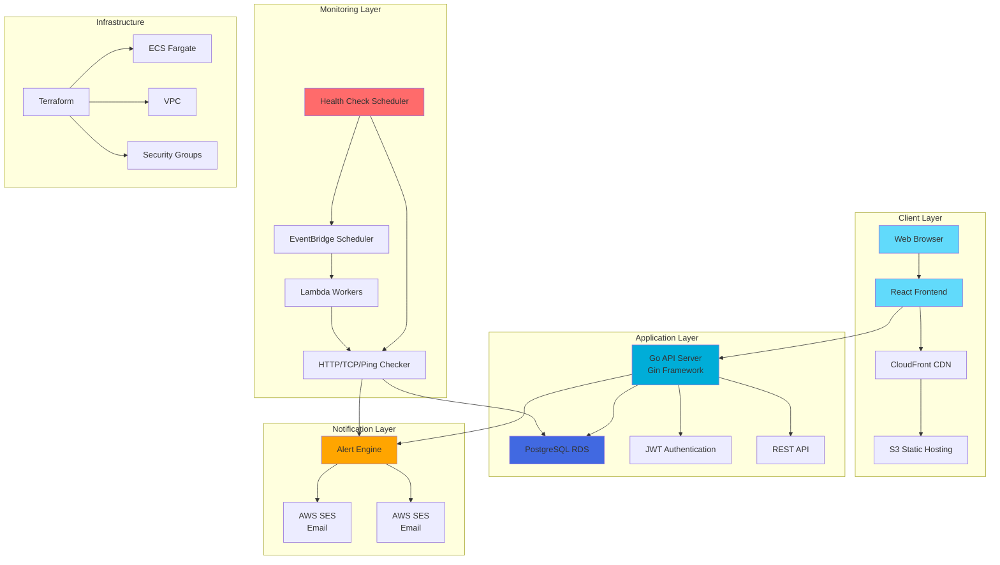

# PulseGrid - Cloud-Native Infrastructure Monitoring Platform


A full-stack, cloud-native monitoring platform that tracks the health, uptime, latency, and performance of web and cloud services. Features statistical analysis with AI-enhanced natural language predictions and intelligent alerting.

[](https://your-api-docs-url.com)

## 🚀 Features

### Core Monitoring

- **Service Monitoring**: Track uptime and performance of URLs, APIs, and IPs
- **Multi-Protocol Support**: HTTP/HTTPS, TCP, and ICMP (ping) monitoring
- **Intelligent Scheduling**: Per-service configurable check intervals (10 seconds to 24 hours)
- **Real-time Health Checks**: Automatic periodic checks with manual trigger capability
- **Response Time Tracking**: Monitor latency trends and performance degradation

### Alerting & Notifications

- **Email Alerts**: AWS SES and SMTP support for email notifications
- **Alert Subscriptions**: Per-service or global alert subscriptions
- **Alert Deduplication**: State transition-based alerting to prevent spam
- **Severity Levels**: Critical, High, Medium, and Low alert classifications

### Analytics & Insights

- **Interactive Dashboards**: Real-time analytics with historical trend visualization
- **AI-Enhanced Predictions**: Statistical analysis combined with OpenAI for natural language insights
  - Performs statistical analysis (failure rates, response time trends, anomaly detection)
  - Uses OpenAI to generate human-readable predictions and recommendations
  - Falls back to rule-based predictions if OpenAI is unavailable
- **Risk Assessment**: Calculates risk levels and confidence scores based on historical data
- **Performance Reports**: Export service statistics as CSV (PDF export planned)
- **Service Statistics**: Uptime percentage, average response time, failure rate tracking

### Multi-Tenant Architecture

- **Organization Isolation**: Secure data isolation by organization
- **Role-Based Access Control (RBAC)**: Three-tier system (Super Admin, Organization Admin, Standard User)
- **User Management**: Admin panel for user and organization management
- **Permission System**: Granular access control for service management

### Infrastructure & Deployment

- **Cloud-Native**: Built on AWS and deployed to production
- **Containerized**: Docker support for consistent deployments
- **Infrastructure as Code**: Terraform for AWS resource management
- **CI/CD**: GitHub Actions pipeline for automated deployments
- **Public API**: Rate-limited public status check endpoint

### Additional Features

- **WebSocket Support**: Real-time updates for dashboard and service status
- **Prometheus Metrics**: Export metrics in Prometheus format
- **Public Status API**: Rate-limited endpoint for checking any HTTP/HTTPS service
- **Health Check History**: Detailed logs with response times and status codes
- **Service Management**: Full CRUD operations for services with organization scoping

## 🏗️ Architecture

### System Architecture Diagram



### Technology Stack

- **Frontend**: React.js + TypeScript + Tailwind CSS + shadcn/ui
- **Backend**: Go (Gin Framework) REST API
- **Database**: PostgreSQL (RDS)
- **Workers**: AWS Lambda (Go) for scheduled health checks
- **Infrastructure**: Terraform for AWS deployment
- **Notifications**: AWS SES (Email)
- **AI Integration**: Statistical analysis with OpenAI for natural language prediction descriptions
- **Containerization**: Docker + Docker Compose
- **State Management**: Zustand
- **Charts**: Recharts
- **WebSockets**: Real-time updates

## 💻 Tech Stack & Key Skills

## 🌐 Stable API Hostname

- **Public base URL**: `http://pulsegrid.duckdns.org:8080/api/v1`
- Backed by DuckDNS dynamic DNS so the hostname stays valid even when the ECS task IP changes.
- `deploy-frontend.sh` automatically updates the DuckDNS record whenever it detects a new backend IP. To enable this automation, export the following before deploying:

```bash
export DUCKDNS_DOMAIN=pulsegrid
export DUCKDNS_TOKEN=<your-duckdns-token>
./deploy-frontend.sh
```

- Manual refresh (if needed):

```bash
curl "https://www.duckdns.org/update?domains=pulsegrid&token=<your-duckdns-token>&ip=<current-backend-ip>"
```

- Share the DuckDNS hostname in docs/demos instead of the raw IP so external developers can consistently reach the public endpoints.

### Frontend Technologies

- **React 18.2** - Modern UI library with hooks and context
- **TypeScript 5.2** - Type-safe JavaScript for better developer experience
- **Vite** - Lightning-fast build tool and dev server
- **Tailwind CSS** - Utility-first CSS framework
- **Zustand** - Lightweight state management
- **React Router** - Client-side routing
- **Recharts** - Composable charting library
- **React Hook Form** - Performant forms with validation
- **Zod** - TypeScript-first schema validation
- **Three.js / OGL** - 3D graphics and animated backgrounds
- **GSAP** - Animation library for smooth transitions

### Backend Technologies

- **Go 1.21+** - High-performance, concurrent programming
- **Gin Framework** - Fast HTTP web framework
- **PostgreSQL** - Robust relational database
- **JWT** - Secure token-based authentication
- **Goroutines** - Concurrent health check execution
- **AWS SDK** - Cloud service integration
- **OpenAI SDK** - AI-powered predictions

### DevOps & Infrastructure

- **Docker** - Containerization for consistent deployments
- **Docker Compose** - Multi-container orchestration
- **Terraform** - Infrastructure as Code (IaC)
- **AWS Services**:
  - ECS Fargate (Container orchestration)
  - RDS (Managed PostgreSQL)
  - S3 + CloudFront (Static hosting & CDN)
  - Lambda (Serverless functions)
  - EventBridge (Scheduled tasks)
  - SES (Email delivery)
  - SSM Parameter Store (Secrets management)
- **GitHub Actions** - CI/CD pipeline automation

### Key Skills Demonstrated

- Full-stack development (React + Go)
- RESTful API design and implementation
- Database design and optimization
- Authentication & authorization (JWT)
- Real-time updates (WebSockets)
- Cloud architecture and deployment
- Infrastructure as Code (Terraform)
- Containerization and orchestration
- CI/CD pipeline setup
- Multi-tenant application architecture
- Error handling and resilience patterns
- Performance optimization
- Statistical analysis and AI-enhanced predictions

## 📁 Project Structure

```
PULSEGRID-V1/
├── backend/          # Go API server
│   ├── cmd/         # Application entry points
│   ├── internal/    # Internal packages
│   │   ├── api/     # HTTP handlers and middleware
│   │   ├── ai/      # AI prediction logic
│   │   ├── checker/ # Health check implementation
│   │   ├── models/  # Data models
│   │   ├── repository/ # Database access layer
│   │   ├── scheduler/ # Health check scheduling
│   │   └── notifier/ # Alert notification service
├── frontend/         # React application
│   ├── src/
│   │   ├── components/ # Reusable UI components
│   │   ├── pages/      # Page components
│   │   ├── hooks/      # Custom React hooks
│   │   ├── store/      # State management
│   │   └── lib/        # Utility functions
├── infrastructure/   # Terraform configurations
├── workers/          # Lambda functions for health checks
├── scripts/          # Deployment and utility scripts
└── docs/             # Documentation
```

## 🛠️ Setup Instructions

### Prerequisites

**For Docker (Recommended):**

- Docker 20.10+
- Docker Compose 2.0+

**For Manual Setup:**

- Go 1.21+
- Node.js 18+
- PostgreSQL 14+
- Terraform 1.5+
- AWS CLI configured

### Backend Setup

```bash
cd backend
go mod download
cp .env.example .env
# Edit .env with your database and AWS credentials
go run cmd/api/main.go
```

### Frontend Setup

```bash
cd frontend
npm install
cp .env.example .env.local
# Edit .env.local with your API endpoint
npm run dev
```

### Infrastructure Deployment

```bash
cd infrastructure
terraform init
terraform plan
terraform apply
```

## 🔐 Environment Variables

See `.env.example` files in each directory for required environment variables.

## 📚 Documentation

- [Docker Setup Guide](./DOCKER_SETUP.md) - 🐳 Run with Docker and Docker Compose
- [Docker & AWS Deployment](./DOCKER_AWS_DEPLOYMENT.md) - ☁️ Complete deployment guide
- [Email Setup Guide](./AWS_SES_SETUP_COMPLETE.md) - 📧 Configure email notifications
- [Infrastructure README](./infrastructure/README.md) - 🏗️ Terraform configuration details
- [Public API Documentation](./PUBLIC_API.md) - 📖 Public status check API
- [Role Hierarchy](./ROLE_HIERARCHY.md) - 👥 RBAC system documentation

## 🎯 Quick Start

### Option 1: Docker Compose (Recommended)

1. **Clone the repository**
2. **Create `.env` file** (see [DOCKER_SETUP.md](./DOCKER_SETUP.md))
3. **Start all services**: `docker-compose up`
4. **Access**: Open `http://localhost:3000` in your browser

See [DOCKER_SETUP.md](./DOCKER_SETUP.md) for detailed Docker instructions.

### Option 2: Manual Setup

1. **Clone the repository**
2. **Set up the database** (PostgreSQL)
3. **Configure backend** (see Backend Setup section above)
4. **Configure frontend** (see Frontend Setup section above)
5. **Start backend**: `cd backend && go run cmd/api/main.go`
6. **Start frontend**: `cd frontend && npm run dev`
7. **Access**: Open `http://localhost:5173` in your browser

## 🔧 What You Need to Provide

### For Local Development

- PostgreSQL database instance
- JWT secret key (generate a secure random string)
- CORS origin (default: http://localhost:3000)
- OpenAI API key (optional, for AI predictions)

### For AWS Deployment

- AWS Account with appropriate permissions
- AWS Access Key ID and Secret Access Key
- Verified email address in AWS SES (for email notifications)
- Unique S3 bucket name for frontend
- Domain name (optional, for custom CloudFront distribution)

### Manual AWS Configuration Required

1. **SES Email Verification**: Verify your email address in AWS SES Console
2. **Domain Setup** (Optional): Configure custom domain for CloudFront
3. **SSL Certificate** (Optional): Request ACM certificate for custom domain

## 📋 What Was Built

### Fully Implemented Features

**User Authentication & Authorization**

- JWT-based authentication
- Role-based access control (Super Admin, Admin, User)
- Multi-tenant organization isolation
  **Service Monitoring**

- Service registration and management (CRUD operations)
- Multi-protocol health checks (HTTP/HTTPS, TCP, ICMP ping)
- Configurable check intervals and timeouts
- Manual health check triggering
  **Real-time Features**

- WebSocket support for live updates
- Real-time dashboard with interactive charts
- Live service status updates
  **Alerting System**

- Email notifications via AWS SES
- Alert subscriptions (per-service or global)
- Alert deduplication to prevent spam
- Alert resolution tracking
  **Analytics & Reporting**

- Service statistics (uptime, response times, failure rates)
- Historical health check data
- CSV report export
- Overview statistics dashboard
  **AI-Enhanced Predictions**

- Statistical analysis of health check data (failure rates, response time trends, anomaly detection)
- Risk level assessment with confidence scoring
- OpenAI integration for natural language descriptions (optional - falls back to rule-based if unavailable)
- Human-readable predictions and recommendations
  **Infrastructure & Deployment**

- Deployed to AWS (ECS Fargate, RDS PostgreSQL, S3 for frontend)
- Infrastructure as Code with Terraform
- Docker containerization
- CI/CD pipeline with GitHub Actions
- Automated health check scheduling via AWS EventBridge and Lambda

  **Public API**

- Rate-limited public status check endpoint
- OpenAPI 3.0 specification documentation

### Partially Implemented

⚠️ **PDF Reports**: Endpoint exists but returns "not implemented" message (CSV export works)  
⚠️ **Load Balancer**: Network Load Balancer configured but not actively routing traffic (system uses direct ECS task IPs)

## 🤖 How AI Predictions Work

The prediction system uses a two-stage approach:

1. **Statistical Analysis** (Always performed):

   - Calculates failure rates from historical health checks
   - Analyzes response time trends (increasing/decreasing/stable)
   - Detects anomalies using standard deviation analysis
   - Determines risk levels (low/medium/high/critical) and confidence scores
   - Identifies status change patterns

2. **AI Enhancement** (Optional, if OpenAI API key is configured):
   - Takes the statistical analysis results
   - Sends aggregated metrics to OpenAI with a structured prompt
   - OpenAI generates human-readable descriptions of:
     - Predicted issue (what might go wrong)
     - Reason (why this prediction was made)
     - Recommended action (what to do about it)
   - Falls back to rule-based descriptions if OpenAI is unavailable

**Note**: The system works without OpenAI - it performs statistical analysis and provides predictions. OpenAI is used to make the output more readable and actionable, not to perform the actual analysis.

## ⚠️ Current Limitations

PulseGrid is a functional monitoring platform with the following known limitations:

- **Email Verification**: The authentication system currently allows sign-up without email verification. This was a deliberate trade-off to focus on core monitoring features.

- **Rate Limiting**: API rate limiting is implemented for the public status endpoint only. Comprehensive rate limiting across all endpoints is recommended for high-traffic deployments.

- **Load Balancer**: The Network Load Balancer is configured but not currently routing traffic. The system uses direct ECS task IPs for connectivity.

- **Test Coverage**: Limited automated test coverage. Manual testing has been performed, but comprehensive test suites are recommended.

- **PDF Reports**: PDF export is planned but not yet implemented. CSV export is available.

These limitations do not impact the core functionality of the monitoring platform and can be addressed as the platform evolves.

## 🚧 Future Enhancements

- Enhanced email verification system
- Comprehensive API rate limiting
- PDF report export
- Additional notification channels (SMS, Slack, webhooks) - code exists but not fully tested/configured
- Enhanced test coverage
- Load balancer configuration improvements
- Advanced analytics and reporting
- Custom alert rules and conditions
- GraphQL API support (optional)
- Multi-cloud support (optional)

## 🔒 Security

### Security Features Implemented

- **JWT Authentication**: Token-based authentication with configurable expiration
- **Password Hashing**: Bcrypt with salt rounds for secure password storage
- **CORS Protection**: Configurable CORS policies to prevent unauthorized access
- **SQL Injection Prevention**: Parameterized queries using prepared statements
- **Multi-tenant Isolation**: Organization-based data separation at the application level
- **Input Validation**: Server-side validation using Go validators and request binding
- **AWS Secrets Management**: SSM Parameter Store for secure secret storage
- **Environment Variables**: Sensitive configuration stored in environment variables, never committed to version control

### Security Best Practices

1. **Never commit secrets**: All `.env` files are in `.gitignore`
2. **Rotate JWT secrets**: Change JWT secrets regularly, especially if exposed
3. **Use strong passwords**: Enforce password complexity requirements
4. **Keep dependencies updated**: Regularly update Go modules and npm packages
5. **Database security**: Use strong database passwords and restrict network access
6. **AWS IAM**: Follow principle of least privilege for AWS credentials
7. **Regular audits**: Review access logs and monitor for suspicious activity

### Reporting Security Issues

If you discover a security vulnerability, please email security concerns to: `sofia.devx@gmail.com`

## 🤝 Contributing

Contributions are welcome! This project is open to contributions from the community.

### How to Contribute

1. **Fork the repository**
2. **Create a feature branch** (`git checkout -b feature/amazing-feature`)
3. **Make your changes** and ensure they follow the project's code style
4. **Add tests** if applicable
5. **Commit your changes** (`git commit -m 'Add some amazing feature'`)
6. **Push to the branch** (`git push origin feature/amazing-feature`)
7. **Open a Pull Request**

### Contribution Guidelines

- Follow the existing code style and conventions
- Write clear, descriptive commit messages
- Add comments for complex logic
- Update documentation as needed
- Ensure all tests pass
- Test your changes thoroughly

### Development Setup

See the [Setup Instructions](#-setup-instructions) section for local development setup.

### Code of Conduct

- Be respectful and inclusive
- Welcome newcomers and help them get started
- Focus on constructive feedback
- Respect different viewpoints and experiences

## 🐛 Issues

Found a bug or have a feature request? We'd love to hear from you!

### Reporting Issues

1. **Check existing issues**: Search [open issues](https://github.com/yourusername/PULSEGRID-V1/issues) to see if your issue has already been reported
2. **Create a new issue**: If it's a new issue, [open a new one](https://github.com/yourusername/PULSEGRID-V1/issues/new)
3. **Provide details**:
   - Clear description of the issue
   - Steps to reproduce (for bugs)
   - Expected vs actual behavior
   - Environment details (OS, Node version, Go version, etc.)
   - Screenshots if applicable

### Issue Labels

- `bug` - Something isn't working
- `enhancement` - New feature or request
- `documentation` - Documentation improvements
- `question` - Further information is requested
- `help wanted` - Extra attention is needed
- `good first issue` - Good for newcomers

### Feature Requests

Feature requests are welcome! Please provide:

- Use case and motivation
- Proposed solution (if you have one)
- Alternatives considered
- Additional context

## 📝 License

This project is licensed under the MIT License - see the [LICENSE](LICENSE) file for details.

## 👤 Author

**Sofia Ali Salahudeen**

- GitHub: (https://github.com/thedevlake)
- LinkedIn: https://www.linkedin.com/in/sofia-salahudeen/
- Email: sofia.devx@gmail.com

## 🙏 Acknowledgments

- Built as a full-stack cloud-native web application demonstrating software engineering, cloud architecture, and DevOps practices
- Deployed to AWS and currently running in production
- Inspired by modern monitoring platforms like UptimeRobot, Pingdom, and StatusCake
- Thanks to the open-source community for the amazing tools and libraries

## ⭐ Show Your Support

If you find this project helpful or interesting, please consider giving it a star on GitHub!
